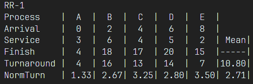
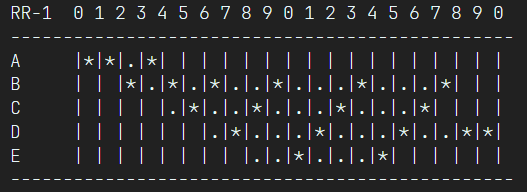

# CPU Scheduler Simulation Using C++ 🕰️

This C++ program simulates various CPU scheduling techniques to determine the most efficient method for managing processes.

## Explaination 📖

### What is the CPU Scheduling?

CPU scheduling, also known as process scheduling, is the process of allocating the CPU time to different processes that are waiting to be executed. This is done by the operating system in order to ensure efficient use of the CPU and to provide a fair share of the CPU time to all processes. CPU scheduling algorithms determine the order in which processes are executed and how much CPU time is allocated to each process.

### Efficient Ways to Schedule Processes 🚀

#### FCFS (First Come First Serve) 🚪

Executes processes in the order they are received by the system. This algorithm does not consider the length of the process or the amount of CPU time required by each process.

#### Round Robin 🔄

Allocates a fixed time slice, also known as a quantum, to each process. Each process is executed for the duration of the quantum, and if it is not finished, it is moved to the end of the queue to wait for its next turn.

#### SPN (Shortest Process Next) 📏

The process with the shortest burst time is considered the next process to be executed, and the burst time of the process is removed from the list of processes. The process is then executed, and once it is finished, the next process with the shortest burst time is selected, and so on.

#### SRT (Shortest Remaining Time) ⏱

Similar to SPN, but it also takes into account the remaining execution time of a process. It selects the process with the shortest remaining execution time to be executed next.

#### HRRN (Highest Response Ratio Next) 📈 

Assigns a priority value to each process, based on the ratio of the waiting time to the burst time of the process. The priority value is calculated using the formula: (waiting time + burst time) / burst time. The process with the highest priority value is then selected to be executed next.

#### FB-1 (Feedback where all queues have q=1) 🔗

feedback mechanism to manage processes. It uses multiple queues, each with a different priority level, and assigns each process to a queue based on its priority level. The process with the highest priority level is executed first, and once it is finished, the next process in the queue is selected.

#### FB-2i (Feedback where q= 2i) 🔁

Similar to FB-1, but uses a different mechanism for assigning priority levels to processes. It also uses multiple queues, but each queue is assigned a fixed value of "q" (2i) where i is the level of the queue. The process with the highest priority level is executed first, and once it is finished, the next process in the queue is selected.

#### Aging ⌛

Used to prevent a process from being in a low priority queue for a prolonged period of time. It is often used in conjunction with other scheduling algorithms such as Round Robin or Priority scheduling.

These mechanisms are implemented in the kernel, and are accessible to user-space processes
through system calls. They provide a way for processes to coordinate and synchronize their
activities, and are commonly used in multi-process and multi-threaded applications.

### Code Need to Know 📊

* Guide.txt contains information on how to configure the scheduler
* You can create your own test cases just add them to the `tests` folder and make sure to add a bash line to test.sh
* **in test.sh you will find already made demo with 12 diffrent scniaro**

### Sample Case 🔬

<p align="center" width="100%">


</p>

## Table of contents :label:

| File Name | Description                                                                                      |
|-----------|--------------------------------------------------------------------------------------------------|
| [Scheduler.cpp](https://github.com/XMaroRadoX/CPU-Scheduling-Techinques-Using-CPP/blob/master/Scheduler.cpp)   | Contians the implementation of producer code using OOP principles|
| [Makefile](https://github.com/XMaroRadoX/CPU-Scheduling-Techinques-Using-CPP/blob/master/Makefile)  | Used to run the program                                                                          |
| [test.sh](https://github.com/XMaroRadoX/CPU-Scheduling-Techinques-Using-CPP/blob/master/test.sh)| contains run tests used by Makefile|
| [Guide.txt](https://github.com/XMaroRadoX/CPU-Scheduling-Techinques-Using-CPP/blob/master/guide.txt)| contains useful info on how to make your own tests

### Pre-requisites :screwdriver:

* Linux : Ubuntu or any debian based distro
* C Compiler
* make

#### Install pre-requisites :toolbox:

Have to be on debian-based distro that have apt as it's package manager to run these commands

```sh
sudo apt update && sudo apt install gcc make

```

### Run :green_circle:

* Navigate to directory
* Run Make

`make`

### Licensing :pencil:

This code is licensed under the MIT License.

### Authors :pen:

* Marwan Radwan

### Contribution :clinking_glasses:

Feel free to contribute just make a pull request and do what you wish. 😼

[](https://opensource.org/licenses/MIT)
